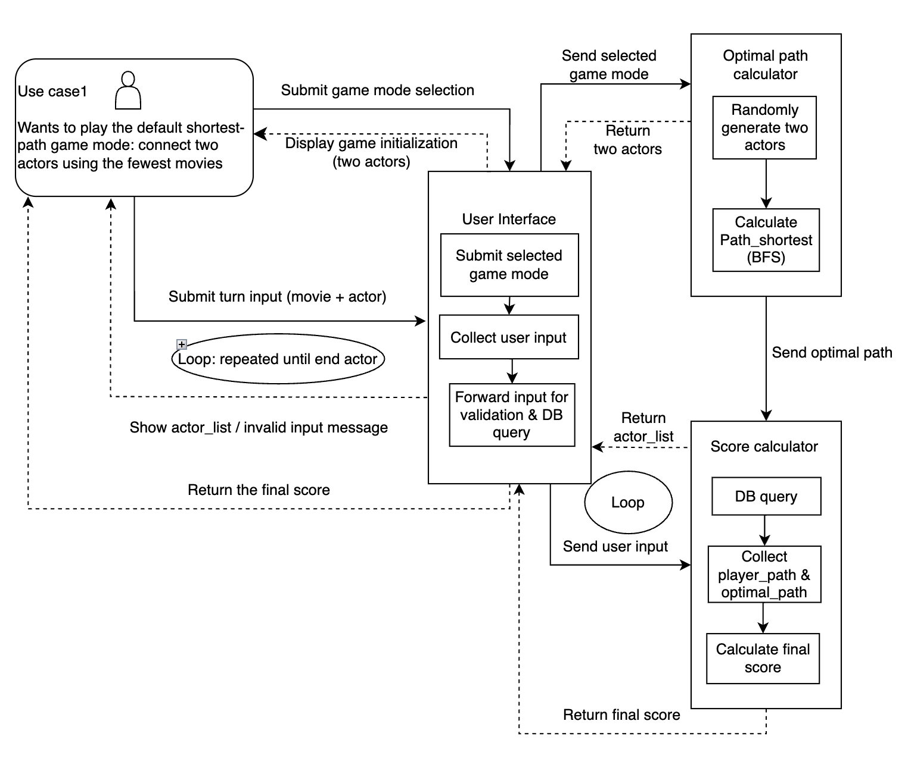
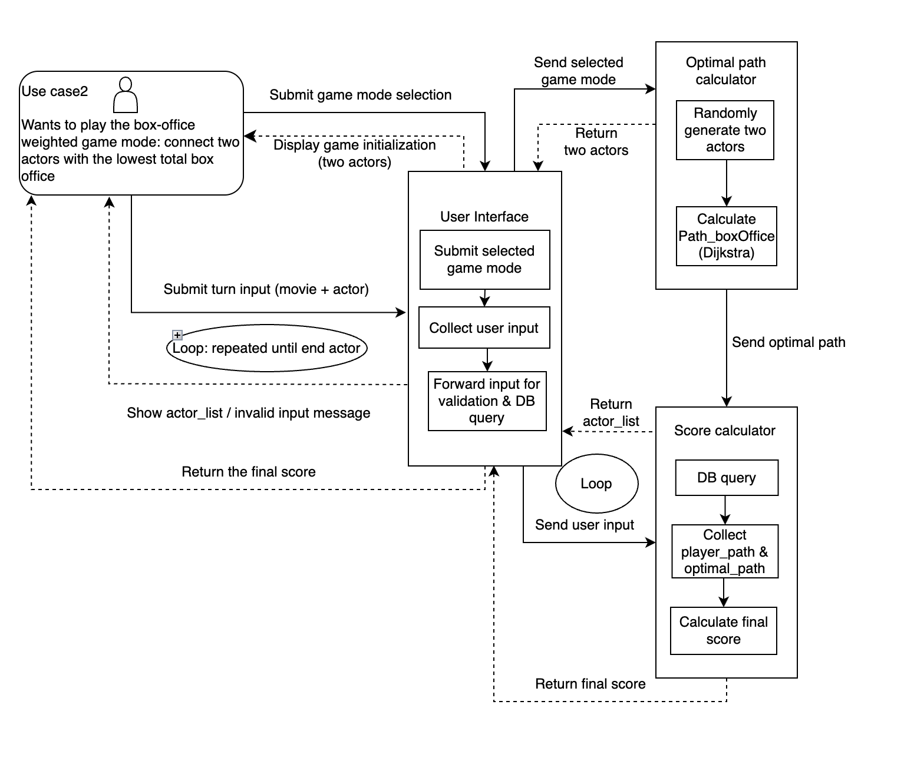

# Component Specifications

## Component 1: Generate Game Instance

- Name: generateGame

- Purpose:

  - Randomly selects a starting & ending actor from the database and calculates the optimal path for scoring comparison using a pathing algorithm

- Inputs:

  - game_type (string): Identifies game mode and how score will be calculated

- Outputs:

  - successful_generation (boolean): returns success state if successful path between start and endpoint is established

- Assumptions:

  - User selects a game mode that is supported

  - Database is well cleaned & formatted for algorithm calculation

## Component 2: Move to New Position

- Name: player_turn

- Purpose:

   - Lets the player take a turn by selecting a valid movie (one that the actor they currently are on stars in) and then selecting a new valid actor from a list associated with the selected movie. One movie + actor combination equates to 1 turn.

- Inputs:

   - input_movie (string): Name of new movie the player wishes to input

  - select_actor (string): Name of new actor from the movie the player selected in input_movie

  - player_path (list): A growing list of moves that the player makes that is fed into and updated every time they take a turn

- Outputs:

   - valid_input (boolean): Returns True if player imputed a valid movie title and False if invalid  - allows the player to try again if False

  - actor_list (list): List of actors in the new movie selected by the player

  - player_path (list): Appended with the new selection the player made assuming the move was successful

- Assumptions:

   - The player is able to input a movie that the actor has been in and also has more than one actor listed.

## Component 3: Least Distance Optimal Pathing Algorithm

- Name: calculatePath_shortest

- Purpose:

   - Calculates the optimal (shortest) path from the start_point to the end_point using Breadth-First Search. The algorithm returns the path with the least number of steps (connections) between two actors

- Inputs:

   - start_point (string): Identifies the location in the database for the algorithm to start

  - end_point (string): Identifies the location in the database for the algorithm to end

- Outputs:

   - optimal_path (list): Optimal path from the algorithm

  - is_successful (boolean): Returns True if path was found, False if not found

- Assumptions: None

## Component 4: Box Office Revenue Optimal Pathing Algorithm

- Name: calculatePath_boxOffice

- Purpose:

   - Calculates the optimal path from start to end point with box office revenue weights using Dijkstra’s Algorithm with Box Office earnings used as weights for calculation  - the lower the Box Office total the better the score

- Inputs:

   - start_point (string): Identifies the location in the database for the algorithm to start

  - end_point (string): Identifies the location in the database for the algorithm to end

- Outputs:

   - optimal_path (list): Optimal path from the algorithm

  - is_successful (boolean): Returns True if path was found, False if not found

- Assumptions: None

## Component 5: Score Calculation

- Name: calculateScore

- Purpose:

   - Calculates the Player Score Based on the player’s selections and compares it to the optimal path calculated by calculatePath_boxOffice, returning a final score based on how close the player’s score was to the optimal

- Inputs:

   - optimal_path (list): Optimal path returned by the path finding algorithms

  - player_path (list): Path the player took in the game

  - game_type (string): Type of game the player selected, determines what metrics score is calculated as

- Outputs:

   - player_score (float): Final score given to the player after results are analyzed

- Assumptions:

   - Player successfully completed the traversal and got to the end point from the starting point

## Component 6: Web App UI

- Name: main.py

- Purpose:

   - Displays the web UI with buttons and interaction to call on other components/logic

- Inputs:

   - current_page (string): The page link the user clicked on

- Outputs:

   - streamlit.Page(): Information and further interactive buttons depending on what the current page is

- Assumptions: None

# Diagrams
## Interaction Diagram  - Shortest Path

## Interaction Diagram  - Least Box Office Sales

