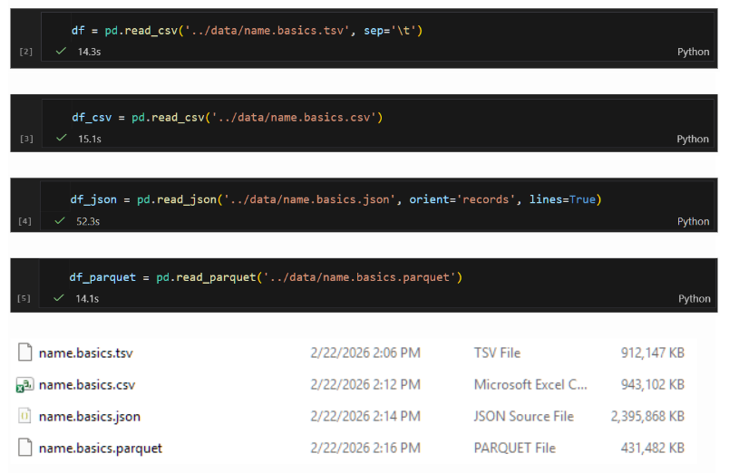

# Technology Review

## Background
In our development, we need to have a large dataset available so that our initialization process can randomly select a start and end point and calculate the optimal path between them for an instance of our game. This means that we need a way to store the data efficiently that lets the program access it on demand when hosted on the cloud through Streamlit. The traditional method used for smaller datasets is to directly upload the data onto the GitHub repository and access it directly, but we found that our datasets were beyond the allocated size when accessed as raw .tsv files. Thus we sought to find an alternative file format to utilize alongside our data processing to minimize the storage space that our dataset will take up in the final repository.

## File Formats Examined
- .csv/.tsv (Comma-Separated Values/Tab Separated Values)
  - Plain text files used to store tabular data where values where values are separated by either commas or tabs, and rows are separated by newlines.
- .parquet (Parquet)
  - Developed by Apache. Stores data column-wise with built-in compression applied for each column.
- JSON (JavaScript Object NOtation)
  - Text-based format for storing structured data that organizes data as key-value pairs that suppports nesting and is human readable.

## Side-By-Side Comparison
Since our main concern is file size and read speeds, we primarily examined those aspects of each format to make a decision. For this test, one of the separate datasets we plan to use from IMDb’s non-commercial datasets was chosen to examine each. Initially saved as a .tsv file, the uncompressed file size was 912,147 KB and took 14.3 seconds to load using the default pandas read_csv() command. After repackaging into the other file formats we are examining (.csv, .parquet, and .json), it was found that the parquet file had both the smallest file size and the fastest access time at 14.1 seconds with pandas, though the load time difference between the .parquet file and the .tsv file was minimal at this file size. The primary benefit we saw between file formats was that the .parquet file was half the size of the .tsv file, which was the next smallest file size.

## Final Decision
When comparing both speed and file size, it was clear that the .parquet file was the best option for our use case, halving the file size of the next best option along with minor access speed improvements.

## Drawbacks & Areas of Concern:
The main drawbacks of the .parquet file type are that it is not human-readable on its own, meaning we would need to either keep another set of the data on hand in a readable format, or load the data into Python every time we want to inspect it. It is also designed for read operations and not frequent write operations, which may present obstacles if we need to change the format the data is in during engineering. These drawbacks should be manageable however, as the project nears completion and final dataset(s) can be saved to the correct format. Finally, the .parquet file type requires a supplementary library to read the data in unlike other file types, meaning an additional installation & version dependency must be considered. This is mostly a one-time concern, however, and the lower file size is significantly more important to the validity of this project.

## Demonstration

